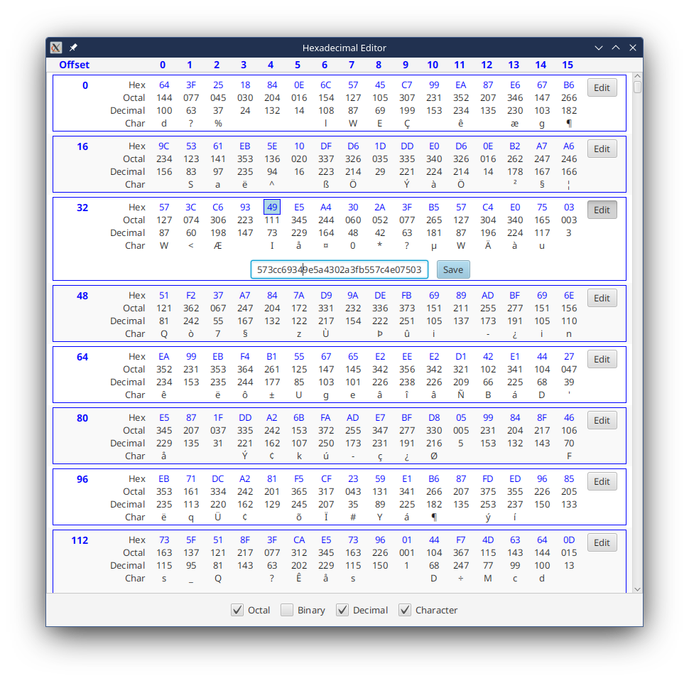

# Examples

Programming examples from on-line questions and discussions.

From time to time I come across discussion topics and questions about JavaFX that I find to be intriguing. So I try to
code them up myself, to see how easy or difficult they really are.

The individual examples are divided up into one per package, with the package name the same as the title listed here.

## HexEditor

This was originally asked as a question about writing huge amounts of Text onto a Canvas, because "TableView cannot
handle the huge amounts of data to be displayed". Once this issue was sorted out, the OP continued on with TableView,
but it seemed to me that this was better done as a ListView. So, here it is.

